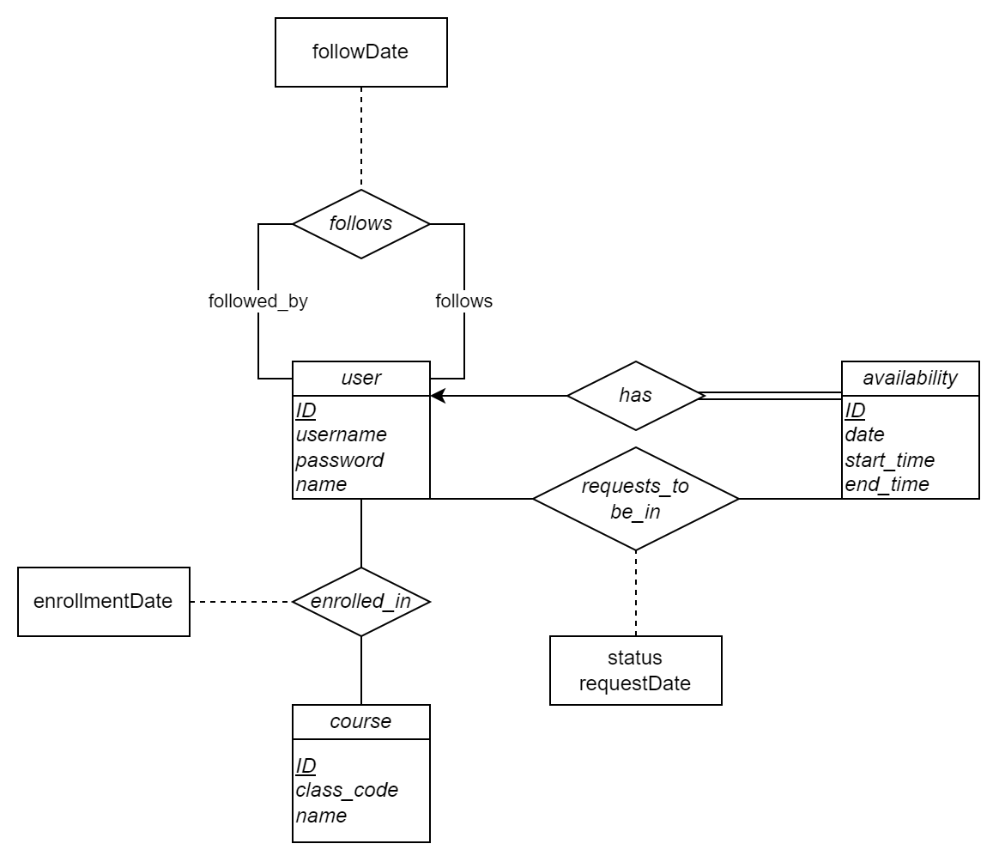

# Project 3 - Study Buddy Database Design

> For CSCI 4370 - Database Management.
> Created by Group 12 - Matthew Griffith, Nilan Patel, Michael Scott, and Bryce Wellman.

## Entity-Relation Model

The following statements describe our application:

- A *user* has a first name last name, and unique username.
- A *class* has a unique code and a title.
- A *user* can be enrolled in any number of *classes*, including zero.
- Any number of *users* can be enrolled in a *class*, including zero.
- A *user* can create any number of *availabilities*, including zero.
- Each *availability* is associated with exactly one *user*.
- Each *availability* has a date, start time, and end time.
- A *user* may request to join any number of *availabilities*, including zero.
- A user's request may be pending, accepted, or denied. The user who owns the *availability* the request was made to can
  see when the request was made.
- An *availability* can have requests for any number of *users*, including zero.
- A *user* can follow other users to be notified of their availabilities.

From these statements, we can create the following ER diagram:



These are made into the following relations:

```sql
CREATE TABLE user
(
    userId    INT,
    username  VARCHAR(255) NOT NULL,
    password  VARCHAR(255) NOT NULL,
    firstName VARCHAR(255) NOT NULL,
    lastName  VARCHAR(255) NOT NULL,
    PRIMARY KEY (userId),
    UNIQUE (username)
);

CREATE TABLE class
(
    classId   INT,
    classCode VARCHAR(50)  NOT NULL,
    className VARCHAR(255) NOT NULL,
    PRIMARY KEY (classId),
    UNIQUE (classCode)
);

CREATE TABLE enrollment
(
    userId         INT,
    classId        INT,
    enrollmentDate DATETIME NOT NULL,
    PRIMARY KEY (userId, classId),
    FOREIGN KEY (userId) REFERENCES user (userId),
    FOREIGN KEY (classId) REFERENCES class (classId)
);

CREATE TABLE follow
(
    followerId INT,
    followeeId INT,
    followDate DATETIME NOT NULL,
    PRIMARY KEY (followerId, followeeId),
    FOREIGN KEY (followerId) REFERENCES user (userId),
    FOREIGN KEY (followeeId) REFERENCES user (userId)
);

CREATE TABLE availability
(
    availabilityId INT,
    userId         INT  NOT NULL,
    studyDate      DATE NOT NULL,
    startTime      TIME NOT NULL,
    endTime        TIME NOT NULL,
    PRIMARY KEY (availabilityId),
    FOREIGN KEY (userId) REFERENCES user (userId),
    UNIQUE (userId, studyDate, startTime)
);

CREATE TABLE study_request
(
    requestId      INT,
    requesterId    INT      NOT NULL,
    availabilityId INT      NOT NULL,
    status         ENUM ('PENDING', 'APPROVED', 'REJECTED') DEFAULT 'PENDING',
    requestDate    DATETIME NOT NULL,
    PRIMARY KEY (requesterId),
    FOREIGN KEY (requesterId) REFERENCES user (userId),
    FOREIGN KEY (availabilityId) REFERENCES availability (availabilityId),
    UNIQUE (requesterId, availabilityId)
);
```

## Functional Dependencies

The following functional dependencies are identifiable from the ER diagram above:

- $userId \to username, password, firstName, lastName$
- $classId \to classCode, className$
- $classCode \to classId, className$
- $userId, classId \to enrollmentDate$
- $followerId, followeeId \to followDate$
- $availabilityId \to userId, date, startTime, endTime$
- $requestId \to requesterId, availabilityId, status, requestDate$
- $requesterId, availabilityId \to requestId, status, requestDate$

($followerId$, $followeeId$, and $requesterId$ are all equivalent to $userId$, but need to be made distinct; otherwise,
one could make the assumption that $userId \in (availabilityId)^{+}$ and erroneously assume that the
FD $requesterId, availabilityId \to requestId, status, requestDate$ has a redundant attribute on the LHS, despite these
referring to two separate users.)

## Normalization

Next, we normalize our tables into 3NF.

### $user$ Table

The following FDs apply to the $user$ table:
- $userId \to username, password, firstName, lastName$

This table is already in 3NF:
- Regarding $userId \to username, password, firstName, lastName$: $userId$ is a super key for $user$.

### $class$ Table

The following FDs apply to the $class$ table:
- $classId \to classCode, className$
- $classCode \to classId, className$

This table is already in 3NF:
- Regarding $classId \to classCode, className$: $classId$ is a super key for $class$.
- Regarding $classCode \to classId, className$: $classCode$ is a super key for $class$.

### $enrollment$ Table

The following FDs apply to the $enrollment$ table:
- $userId, classId \to enrollmentDate$

This table is already in 3NF:
- Regarding $userId, classId \to enrollmentDate$: $(userId, classId)$ is a super key for $enrollment$.

### $follow$ Table

The following FDs apply to the $follow$ table:
- $followerId, followeeId \to followDate$

This table is already in 3NF:
- Regarding $followerId, followeeId \to followDate$: $(followerId, followeeId)$ is a super key for $follow$.

### $availability$ Table

The following FDs apply to the $availability$ table:
- $availabilityId \to userId, date, startTime, endTime$

This table is already in 3NF:
- Regarding $availabilityId \to userId, date, startTime, endTime$: $availabilityId$ is a super key for $availability$.

### $study\_request$ Table

The following FDs apply to the $study\_request$ table:
- $requestId \to requesterId, availabilityId, status, requestDate$
- $requesterId, availabilityId \to requestId, status, requestDate$

This table is already in 3NF:
- Regarding $requestId \to requesterId, availabilityId, status, requestDate$: $(requestId, availabilityId)$ is a super key for $study\_request$.
- Regarding $requesterId, availabilityId \to requestId, status, requestDate$: $(requesterId, availabilityId)$ is a super key for $study\_request$.

----

Since all of our tables are already in 3NF, we do not need to do any further work.