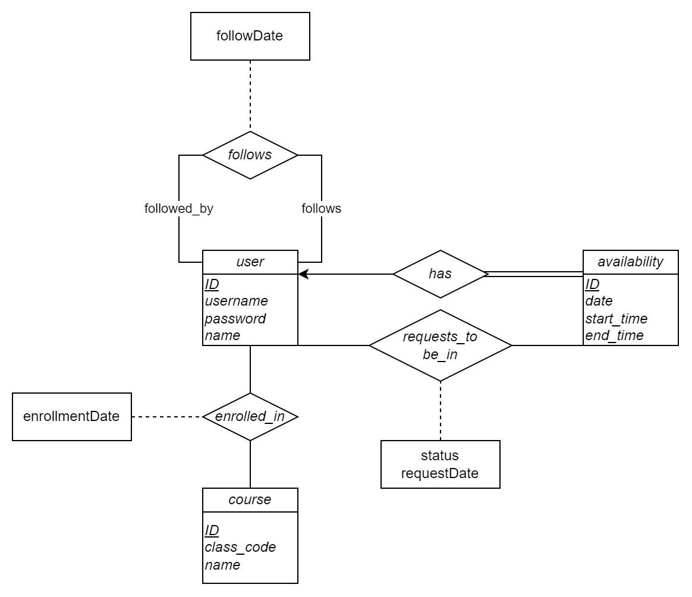

# Project 3 - Study Buddy

> For CSCI 4370 - Database Management.
> Created by Group 12 - Matthew Griffith, Nilan Patel, Michael Scott, and Bryce Wellman.

**Study Buddy** will be a simple website used to coordinate study sessions between students.

## Problem

Coordinating group study sessions can be cumbersome; you need to know people in the class(es) you want to study for, know that they also need to study, confirm that they want to study in a group and not by themself, *and* have a specific date, time, and location that works for everyone involved. It's possible to work this out by just talking to people, but in the worst-case scenario, you could be talking to a dozen different people, asking and answering the same questions over and over again.

It'd be nice if there was a way for you to know which classes someone wants to study for and when they'd be available to study -- this would take most of the tedium out of planning study sessions.

## Solution

Our website, **Study Buddy**, plans to solve this problem. Students will be able to list which classes they are in and when they have time to study for them. Then, other users of the website can easily search for study sessions for a particular class and request to join someone's study session.

### Interface

**Study Buddy** will use a Web-based interface with the following pages:

| Webpage               | Function                                                                                                                                                   |
|-----------------------|------------------------------------------------------------------------------------------------------------------------------------------------------------|
| Log In / Registration | Allows users to log into their account or to make a new account.                                                                                           |
| Homepage              | Shows a selection of upcoming study sessions for classes the current user is in, plus all study sessions that the current user has joined or is a part of. |
| Profile Page          | Shows a user's basic information (e.g., name and registered classes). The logged-in user may change their basic information on their own profile page.     |
| Class Search          | Allows searching for users in a particular class.                                                                                                          |
| Study Request         | Shows all pending requests for the current user (sent or received), as well as allowing the current user to send requests to other users.                  |

## Entity-Relation Diagram

## Used Technologies

| Technology            | Usage Reason                                                                    |
|-----------------------|---------------------------------------------------------------------------------|
| Java                  | Primary backend programming language.                                           |
| HTML, CSS, JavaScript | Used for creating the Web frontend of the project.                              |
| Spring Boot           | Used as the basis of the website.                                               |
| Mustache              | Used to create templates of frontend HTML files to be populated by Spring Boot. |
| Docker                | Used to host the database used by the project.                                  |
| MySQL                 | Used as the DBMS for this project.                                              |
| JDBC                  | Used to communicate with the  MySQL database.                                   |